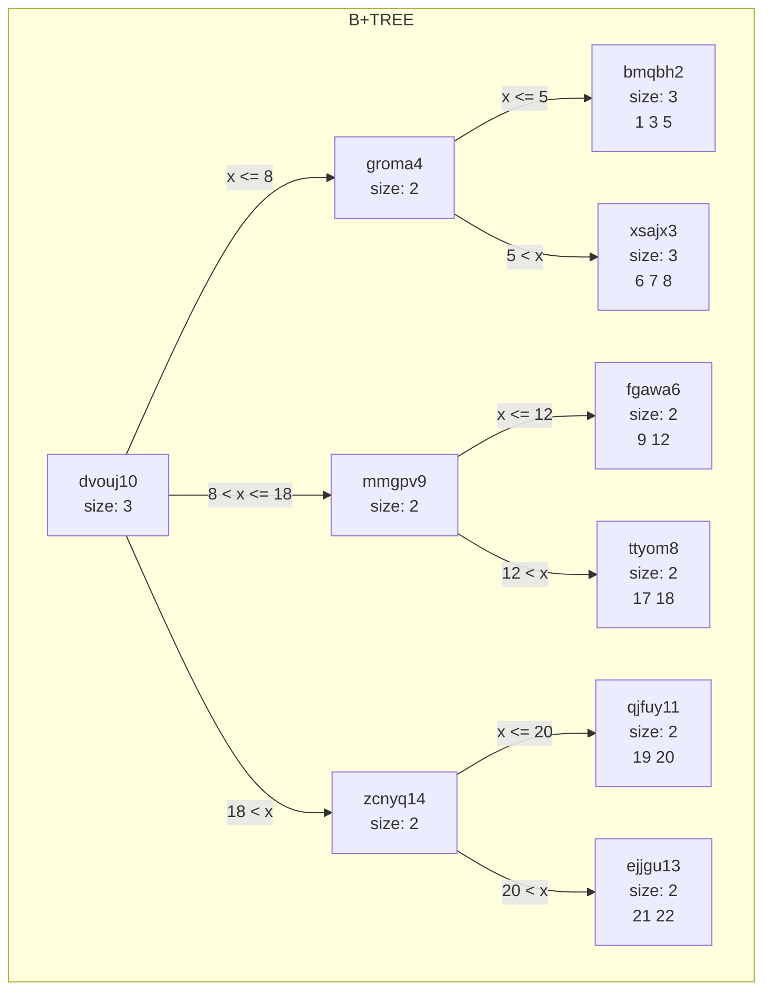
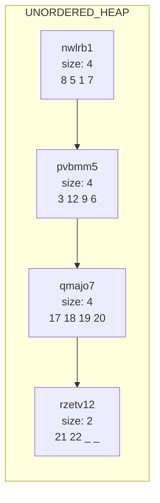

```mermaid
graph TD
subgraph B+TREE
dvouj10[dvouj10<br/>size: 3<br/>]
groma4[groma4<br/>size: 2<br/>]
bmqbh2[bmqbh2<br/>size: 3<br/>1 3 5 ]
groma4-->|x <= 5|bmqbh2
xsajx3[xsajx3<br/>size: 3<br/>6 7 8 ]
groma4-->|5 < x|xsajx3
dvouj10-->|x <= 8|groma4
mmgpv9[mmgpv9<br/>size: 2<br/>]
fgawa6[fgawa6<br/>size: 2<br/>9 12 ]
mmgpv9-->|x <= 12|fgawa6
ttyom8[ttyom8<br/>size: 2<br/>17 18 ]
mmgpv9-->|12 < x|ttyom8
dvouj10-->|8 < x <= 18|mmgpv9
zcnyq14[zcnyq14<br/>size: 2<br/>]
qjfuy11[qjfuy11<br/>size: 2<br/>19 20 ]
zcnyq14-->|x <= 20|qjfuy11
ejjgu13[ejjgu13<br/>size: 2<br/>21 22 ]
zcnyq14-->|20 < x|ejjgu13
dvouj10-->|18 < x|zcnyq14
end
```

```mermaid
graph LR
subgraph UNORDERED_HEAP
nwlrb1[nwlrb1<br/>size: 4<br/>8 5 1 7 ]
pvbmm5[pvbmm5<br/>size: 4<br/>3 12 9 6 ]
nwlrb1-->pvbmm5
qmajo7[qmajo7<br/>size: 4<br/>17 18 19 20 ]
pvbmm5-->qmajo7
rzetv12[rzetv12<br/>size: 2<br/>21 22 _ _ ]
qmajo7-->rzetv12
end
```
