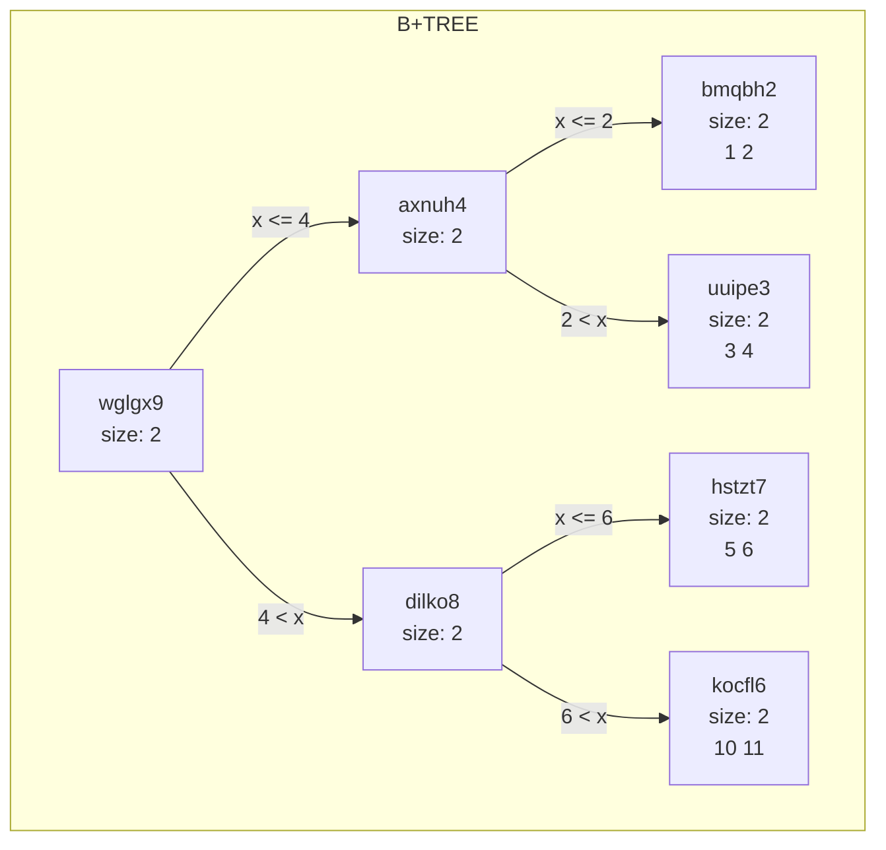
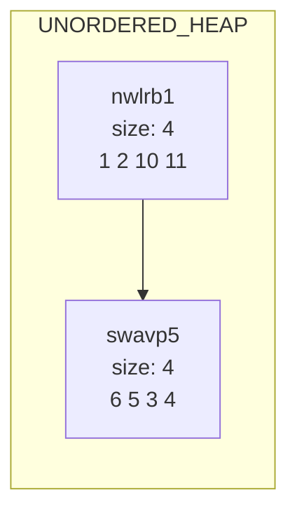

```mermaid
graph TD
subgraph B+TREE
wglgx9[wglgx9<br/>size: 2<br/>]
axnuh4[axnuh4<br/>size: 2<br/>]
bmqbh2[bmqbh2<br/>size: 2<br/>1 2 ]
axnuh4-->|x <= 2|bmqbh2
uuipe3[uuipe3<br/>size: 2<br/>3 4 ]
axnuh4-->|2 < x|uuipe3
wglgx9-->|x <= 4|axnuh4
dilko8[dilko8<br/>size: 2<br/>]
hstzt7[hstzt7<br/>size: 2<br/>5 6 ]
dilko8-->|x <= 6|hstzt7
kocfl6[kocfl6<br/>size: 2<br/>10 11 ]
dilko8-->|6 < x|kocfl6
wglgx9-->|4 < x|dilko8
end
```

```mermaid
graph LR
subgraph UNORDERED_HEAP
nwlrb1[nwlrb1<br/>size: 4<br/>1 2 10 11 ]
swavp5[swavp5<br/>size: 4<br/>6 5 3 4 ]
nwlrb1-->swavp5
end
```
