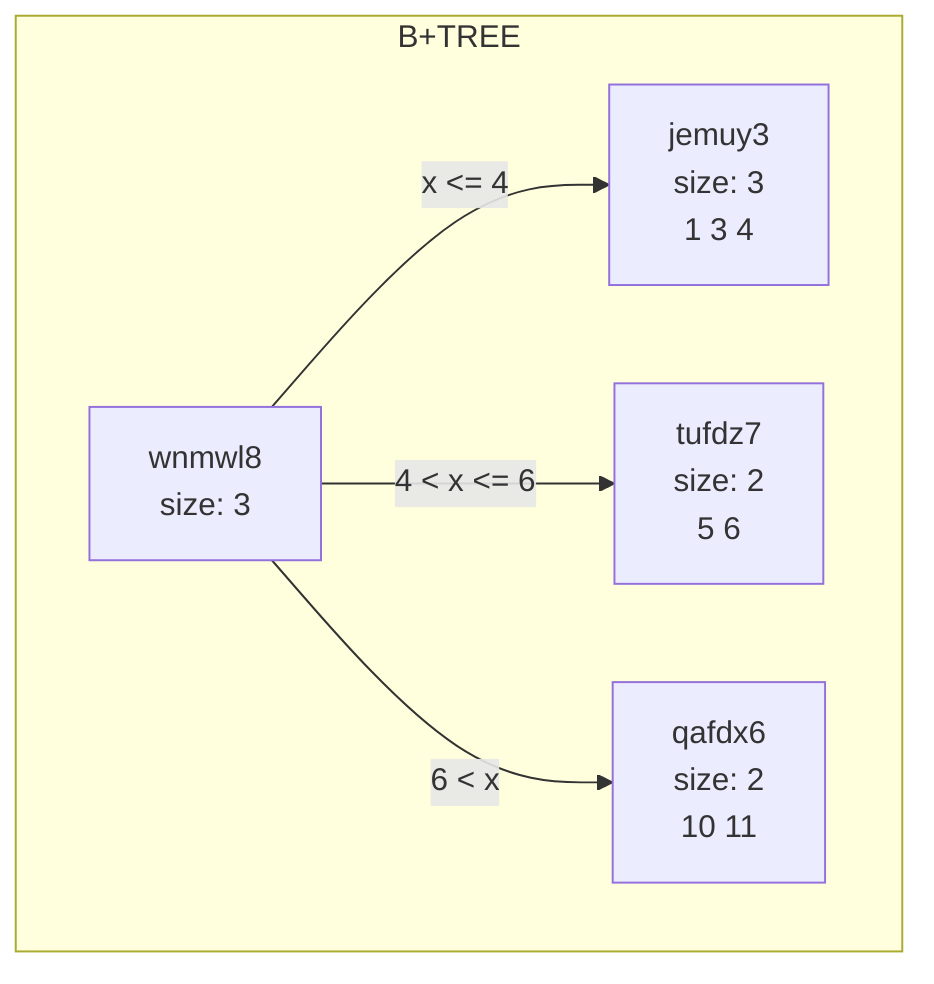
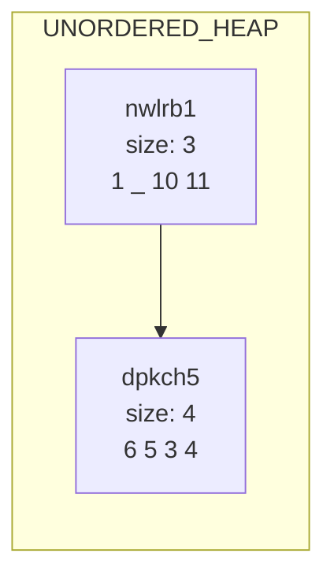

```mermaid
graph TD
subgraph B+TREE
wnmwl8[wnmwl8<br/>size: 3<br/>]
jemuy3[jemuy3<br/>size: 3<br/>1 3 4 ]
wnmwl8-->|x <= 4|jemuy3
tufdz7[tufdz7<br/>size: 2<br/>5 6 ]
wnmwl8-->|4 < x <= 6|tufdz7
qafdx6[qafdx6<br/>size: 2<br/>10 11 ]
wnmwl8-->|6 < x|qafdx6
end
```

```mermaid
graph LR
subgraph UNORDERED_HEAP
nwlrb1[nwlrb1<br/>size: 3<br/>1 _ 10 11 ]
dpkch5[dpkch5<br/>size: 4<br/>6 5 3 4 ]
nwlrb1-->dpkch5
end
```
