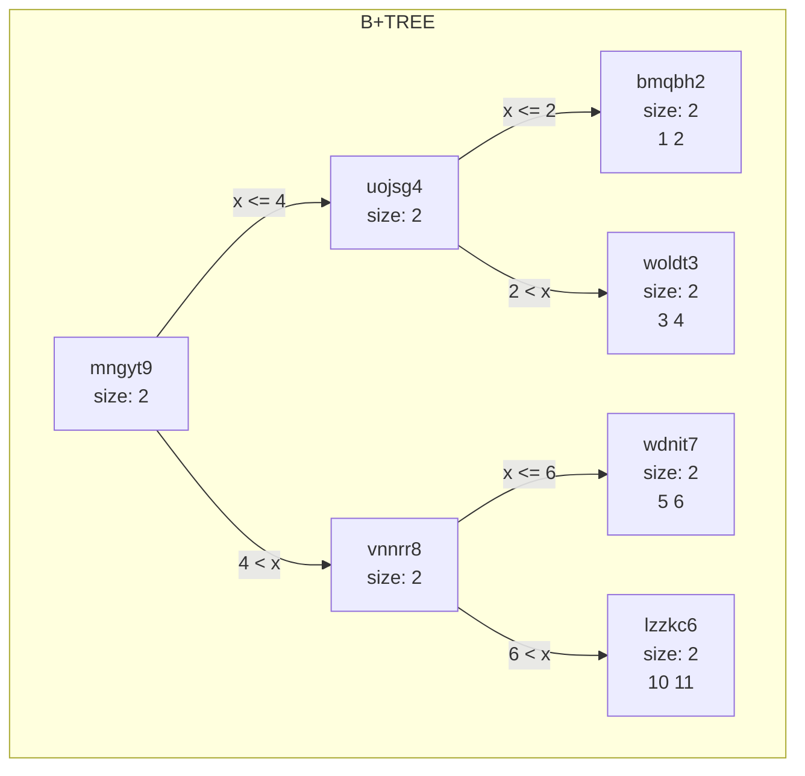
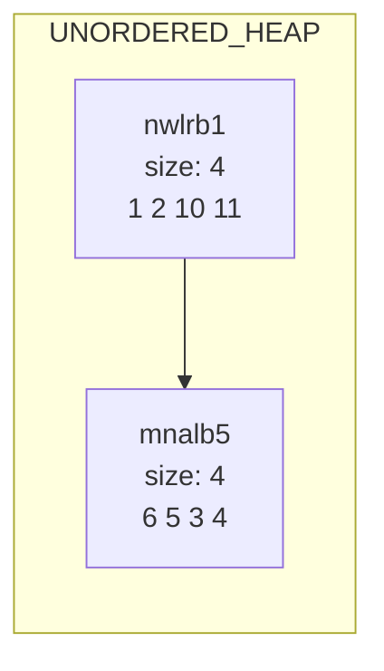

```mermaid
graph TD
subgraph B+TREE
mngyt9[mngyt9<br/>size: 2<br/>]
uojsg4[uojsg4<br/>size: 2<br/>]
bmqbh2[bmqbh2<br/>size: 2<br/>1 2 ]
uojsg4-->|x <= 2|bmqbh2
woldt3[woldt3<br/>size: 2<br/>3 4 ]
uojsg4-->|2 < x|woldt3
mngyt9-->|x <= 4|uojsg4
vnnrr8[vnnrr8<br/>size: 2<br/>]
wdnit7[wdnit7<br/>size: 2<br/>5 6 ]
vnnrr8-->|x <= 6|wdnit7
lzzkc6[lzzkc6<br/>size: 2<br/>10 11 ]
vnnrr8-->|6 < x|lzzkc6
mngyt9-->|4 < x|vnnrr8
end
```

```mermaid
graph LR
subgraph UNORDERED_HEAP
nwlrb1[nwlrb1<br/>size: 4<br/>1 2 10 11 ]
mnalb5[mnalb5<br/>size: 4<br/>6 5 3 4 ]
nwlrb1-->mnalb5
end
```
