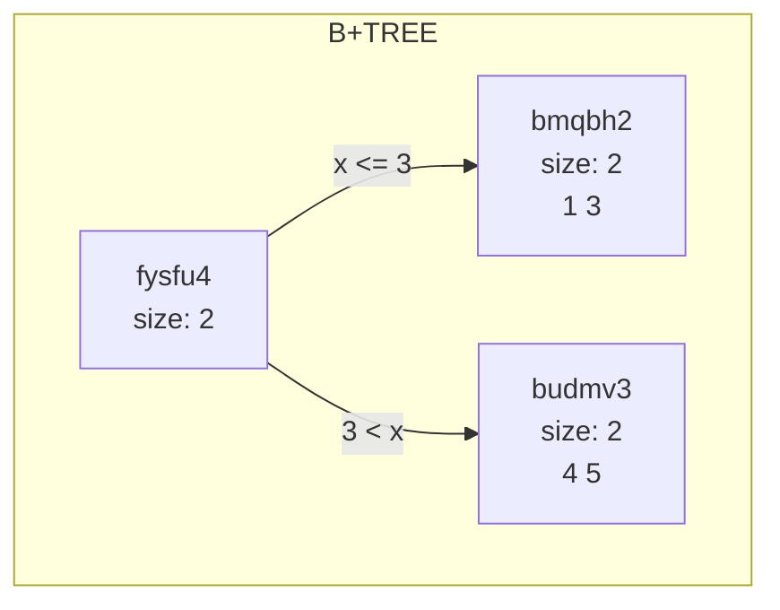
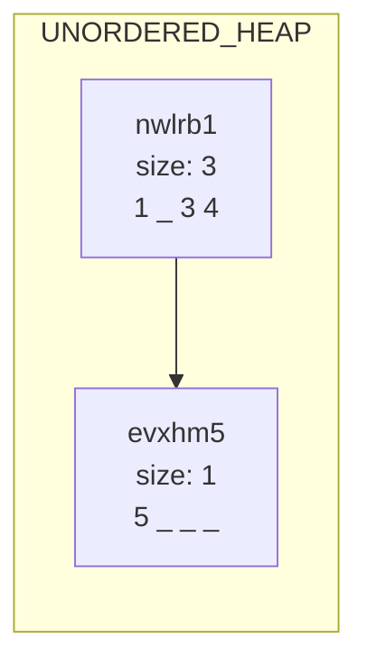

```mermaid
graph TD
subgraph B+TREE
fysfu4[fysfu4<br/>size: 2<br/>]
bmqbh2[bmqbh2<br/>size: 2<br/>1 3 ]
fysfu4-->|x <= 3|bmqbh2
budmv3[budmv3<br/>size: 2<br/>4 5 ]
fysfu4-->|3 < x|budmv3
end
```

```mermaid
graph LR
subgraph UNORDERED_HEAP
nwlrb1[nwlrb1<br/>size: 3<br/>1 _ 3 4 ]
evxhm5[evxhm5<br/>size: 1<br/>5 _ _ _ ]
nwlrb1-->evxhm5
end
```
