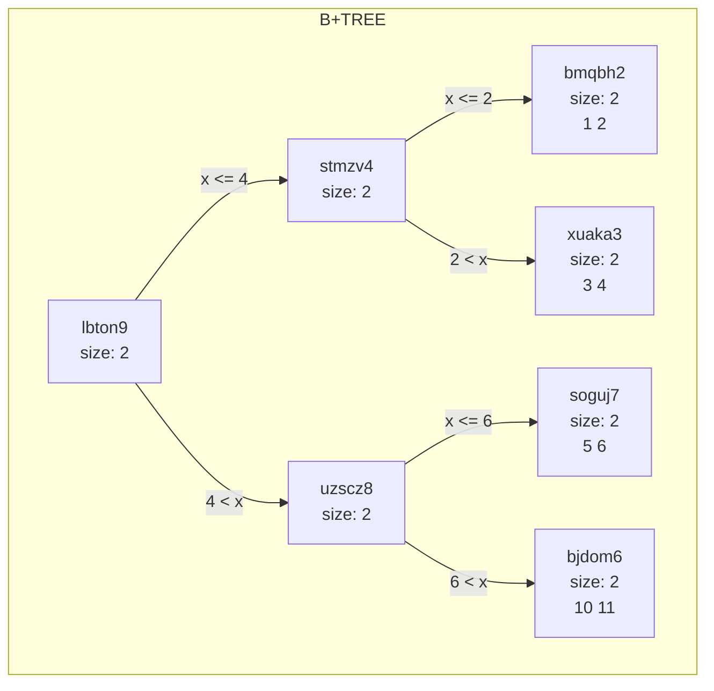
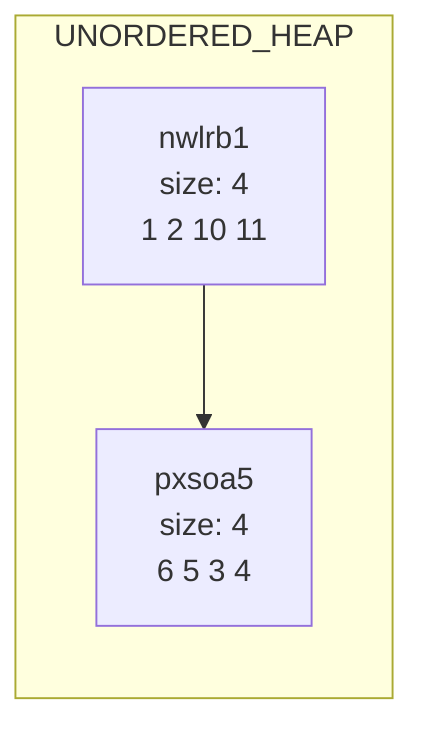

```mermaid
graph TD
subgraph B+TREE
lbton9[lbton9<br/>size: 2<br/>]
stmzv4[stmzv4<br/>size: 2<br/>]
bmqbh2[bmqbh2<br/>size: 2<br/>1 2 ]
stmzv4-->|x <= 2|bmqbh2
xuaka3[xuaka3<br/>size: 2<br/>3 4 ]
stmzv4-->|2 < x|xuaka3
lbton9-->|x <= 4|stmzv4
uzscz8[uzscz8<br/>size: 2<br/>]
soguj7[soguj7<br/>size: 2<br/>5 6 ]
uzscz8-->|x <= 6|soguj7
bjdom6[bjdom6<br/>size: 2<br/>10 11 ]
uzscz8-->|6 < x|bjdom6
lbton9-->|4 < x|uzscz8
end
```

```mermaid
graph LR
subgraph UNORDERED_HEAP
nwlrb1[nwlrb1<br/>size: 4<br/>1 2 10 11 ]
pxsoa5[pxsoa5<br/>size: 4<br/>6 5 3 4 ]
nwlrb1-->pxsoa5
end
```
